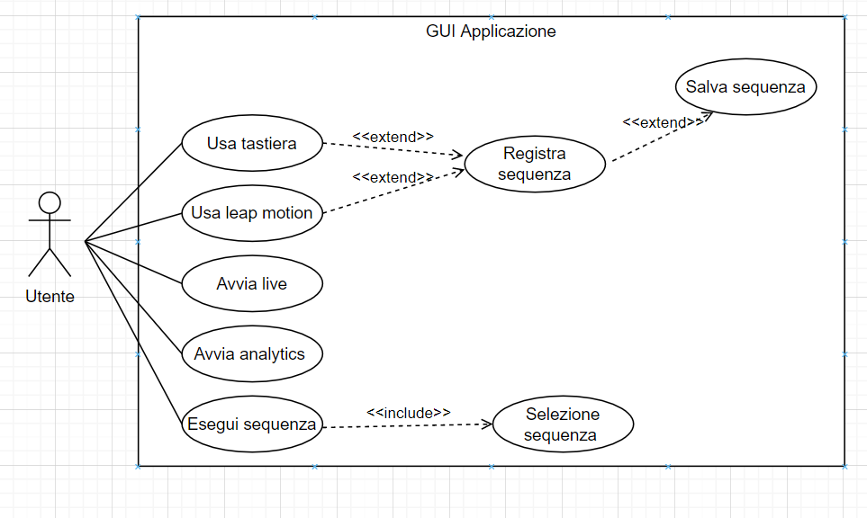
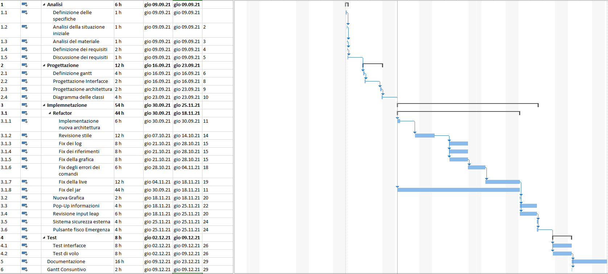
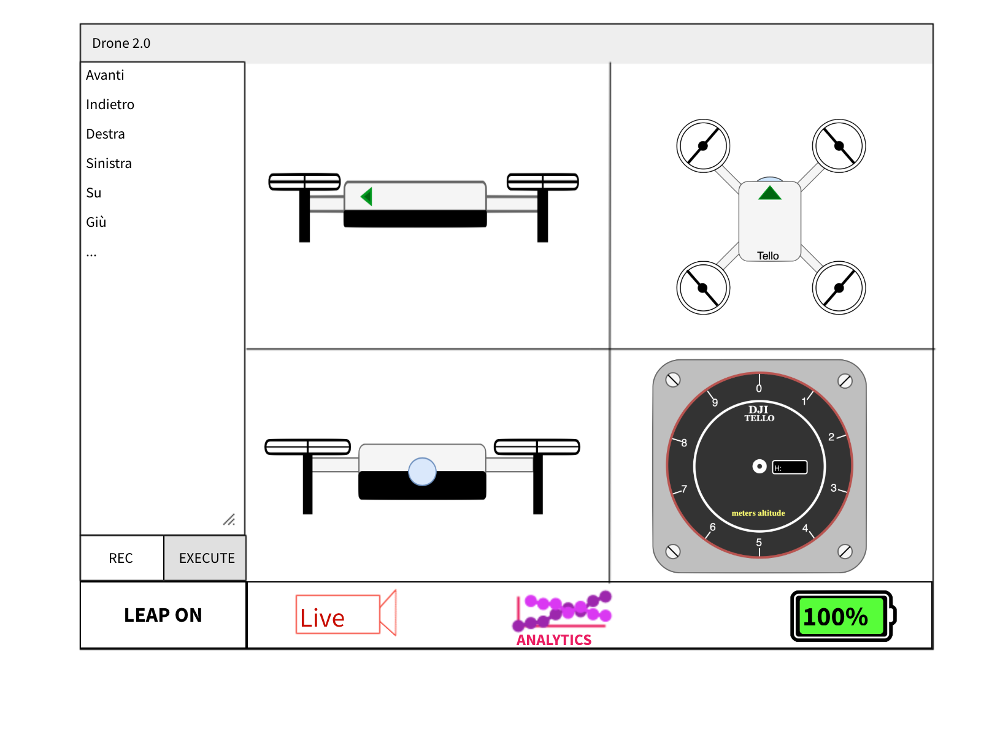
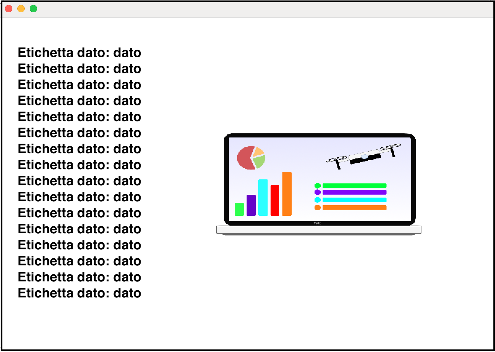
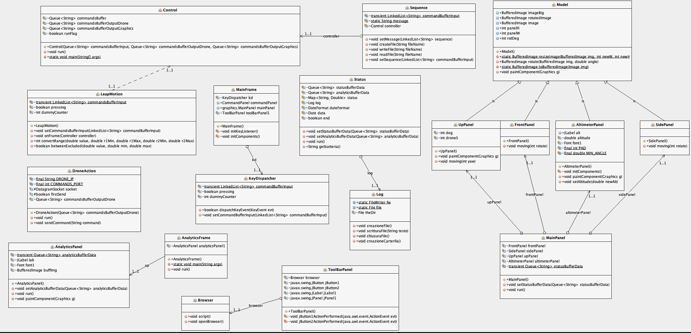

1. [Introduzione](#introduzione)
	- [Informazioni sul progetto](#informazioni-sul-progetto)
	- [Abstract](#abstract)
	- [Scopo](#scopo)

2. [Analisi](#analisi)
	- [Analisi del dominio](#analisi-del-dominio)
	- [Analisi e specifica dei requisiti](#analisi-e-specifica-dei-requisiti)
	- [Use case](#use-case)
	- [Pianificazione](#pianificazione)
	- [Analisi dei mezzi](#analisi-dei-mezzi)

3. [Progettazione](#progettazione)
	- [Design delle interfacce](#design-delle-interfacce)
		- [Interfaccia principale](#interfaccia-principale)
	- [Pop-up informazioni](#pop-up-informazioni)
	- [Schema della classi](#schema-delle-classi)

4. [Implementazione](#implementazione)
	- [Introduzione implementazione](#introduzione-implementazione)
	- [Refactor generale](#refactor-generale)
		- [Control](#control)
		- [DroneAction](#droneAction)
		- [Status](#status)
		- [Key Dispatcher](#keyDispatcher)
		- [CommandPanel](#commandPanel)
		- [Sequence](#sequence)
	- [Refactor e implementazione grafica](#refactor-e-implementazione-grafica)
		- [MainPanel](#MainPanel)
		- [Model](#Model)
		- [SidePanel e FrontPanel](#SidePanel-e-FrontPanel)
		- [UpPanel](#UpPanel)
		- [AltimeterPanel](#AltimeterPanel)
	- [Refactor e implementazione dei tools](#refactor-e-implementazione-dei-tools)
		- [Live](#Live)
		- [ToolbarPanel](#ToolbarPanel)
		- [AnalyticsFrame](#AnalyticsFrame)
		- [AnalyticsPanel](#AnalyticsPanel)
	- [Leap Motion](#leap-motion)

5. [Test](#test)
  - [Protocollo di test e risultati](#protocollo-di-test-e-risultati)
  - [Test case di base](#test-case-di-base)
  - [Risultati test case di base](#risultati-test-case-di-base)
  - [Mancanze e limitazioni conosciute](#mancanze-e-limitazioni-conosciute)

6. [Consuntivo](#consuntivo)

7. [Conclusioni](#conclusioni)
  - [Considerazioni finali](#considerazioni-finali)
  - [Considerazioni personali](#considerazioni-personali)
  - [Sviluppi futuri](#sviluppi-futuri)

8. [Sitografia](#sitografia)

9. [Allegati](#allegati)


# Introduzione
### Informazioni sul progetto
- Allievi coinvolti nel progetto:  Gianni Grasso, Samuele Ganci, Alessandro Aloise, Michea Colautti.
- Classe: I3BB Scuola Arti e Mestieri Trevano, sezione Informatica.
- Docenti responsabili: Luca Muggiasca.
- Data inizio: 09 settembre  2021.
- Data di fine: 23 Dicembre 2021.

### Abstract

  > *Drones are more and  more common in our society. Today we see drone operating everywhere, in every sector. We see drone used in the military, in construction site, Amazon and other companies use drone to ship packet of merch to the people, in some cases drone even deliver the post. For this reason, we want to improve our drone control system, we will make a radical refactor of our old structure, adding new graphics, improving communications, and so on. Thanks to this project piloting a DJI Tello drone will become easy and fun. As the old project we will use, in addition to our drone, a Leap Motion sensor to track movements, the drone will be fully controllable with this sensor and even with the keyboard.
Our project will be even more secure, we will enable and create some safety feature so that anyone can use our product without hurting someone or themselves.*


### Scopo

  Lo scopo del progetto è di creare un software in grado di collegare i movimenti delle nostre mani ad un drone.
  In pratica, grazie a un sensore chiamato `Leap Motion`, la nostra applicazione deve essere in grado di catturare e analizzare i movimenti
  delle mani e, dopo averli processati, trasmetterli al drone. Per farlo dobbiamo usare la tecnologia `UDP` (**U**ser **D**atagram **P**rotocol) e
  l'`SDK` installata di fabbrica sul drone.
  Dobbiamo, oltre a creare il sistema di pilotaggio, instaurare una comunicazione che permetta lo scambio di dati del drone; non solo dati come l'inclinazione,       l'altitudine, ma anche dati statistici come la batteria.

# Analisi
### Analisi del dominio

È stato richiesto di correggere e migliorare l'interfaccia di controllo drone da noi creata un anno fa. Il programma che avevamo fatto presentava infatti molte imperfezioni ed elementi che non funzionavano. Per questo approfitteremo della presenza di 3 membri del gruppo su 4 per riprendere il progetto, correggerlo, e magari aggiungere nuove funzionalità. Alla fine verrà prodotta un interfaccia di controllo per un drone DJI Tello, fortemente basata sulla nostra prima versione, ma migliorata: nell'aspetto grafico, nelle dinamiche di controllo, nella struttura del codice e anche in maniera minore, negli obbiettivi.


### Analisi e specifica dei requisiti


|              |**ID: Req-001**|
|--------------|----------------|
|**Nome**      | Rappresentazioni drone seguono movimenti |
|**Priorità**  | 1              |
|**Versione**  | 1.1            |
|**Note**      | Quando il drone decolla la grafica ne segue i movimenti|

|               |**ID: Req-002**|
|--------------|----------------|
|**Nome**      | Pannello altitudine deve mostrare la batteria, l'altezza, e altri parametri ancora da decidere. |
|**Priorità**  | 2              |
|**Versione**  | 1.1            |
|**Note**      | Rivedere ad (eventuale) arrivo nuovo drone|


|               |**ID: Req-003**|
|--------------|----------------|
|**Nome**      | Sistema di Log deve essere sistemato |
|**Priorità**  | 1              |
|**Versione**  | 1.1            |
|**Note**      | La main Thread non viene fatta partire|


|               |**ID: Req-004**|
|--------------|----------------|
|**Nome**      | Fix crash Jar |
|**Priorità**  | 1              |
|**Versione**  | 1.1            |
|**Note**      | Il JAR crasha alla selezione del Leap.|


|               |**ID: Req-005**|
|--------------|----------------|
|**Nome**      | Gestione dimensioni interfaccia |
|**Priorità**  | 1              |
|**Versione**  | 1.1            |
|**Note**      |                |


|               |**ID: Req-006**|
|--------------|----------------|
|**Nome**      | Mostrare percentuale batteria|
|**Priorità**  | 1              |
|**Versione**  | 1.1            |
|**Note**      | Ad oggi il numero non viene mostrato|


|               |**ID: Req-007**|
|--------------|----------------|
|**Nome**      |Rivedere sistema di Live stream|
|**Priorità**  | 1              |
|**Versione**  | 1.1            |
|**Note**      | Durante fase di test: file non trovato|

|               |**ID: Req-008**|
|--------------|----------------|
|**Nome**      | Revisione comandi e input tramite Leap motion|
|**Priorità**  | 1              |
|**Versione**  | 1.1            |
|**Note**      | |


|               |**ID: Req-009**|
|--------------|----------------|
|**Nome**      | Sistema di sicurezza esterno|
|**Priorità**  | 1              |
|**Versione**  | 1.1            |
|**Note**      | Sistema di backup di Emergency|


|               |**ID: Req-010**|
|--------------|----------------|
|**Nome**      | Pulsante esterno fisico per Emergency |
|**Priorità**  | 3              |
|**Versione**  | 1.1            |
|**Note**      | |


|               |**ID: Req-011**|
|--------------|----------------|
|**Nome**      | Frame Pop-Up per display infomrazioni |
|**Priorità**  | 2              |
|**Versione**  | 1.1            |
|**Note**      | |


### Use case

Ecco il nostro Use Case

> Use Case

### Pianificazione

Per la pianificazione alleghiamo il Gantt preventivo da noi stabilito:

> Gantt preventivo


### Analisi dei mezzi

 **Software**
 - Java JDK 12.0.2
 - Java JDK 14.0.2
 - Java JDK 16.0.2
 - Leap Motion SDK 3.2.1
 - Tello SDK 2.0
 - Apache NetBeans IDE 12.0

 **Hardware**
- Laptop personali
- PC scolastici
- Drone DJI Tello
- Leap Motion


<div style="page-break-after: always;"></div>

# Progettazione

## Design delle interfacce

### Interfaccia principale
Abbiamo preso la vecchia interfaccia e abbiamo cambiato tutto quello che non ci convinceva e abbiamo cercato di renderla più user friendly e più accattivante:

> Interfaccia drone

Come si può vedere rispetto alla prima versione del progetto l'interfaccia è cambiata: sulla sinistra troviamo, come del resto era nella versione recedente, la lista dei comandi eseguiti. La novità è che al posto di essere una lunga sequenza di istruzioni incomprensibili, stampiamo una traduzione in modo tale che l'utente possa capire meglio cosa sta succedendo. Altre modifiche sostanziali sono:
* Abbiamo cambiato il riquadro in basso a destra; dove prima c'era un valore numerico con l'altitudine ora rappresentiamo lo stesso valore in 2 modi. Il primo è tramite una lancetta rossa, non visibile nella progettazione, che percorre l'altimetro in base all'altezza. Il secondo sarà invece il valore dell'altitudine numerico, convertito in metri, e inserito nello spazio nero apposito.
* Inoltre abbiamo cambiato completamente la gestione della barra inferiore in modo tale che sia più pulita e ordinata


### Pop-up informazioni.

In questa versione del progetto abbiamo progettato anche un Pop-up che ci permetterà di stampare a schermo le informazioni che il drone colleziona durante il volo. Non è stato fatto nel progetto vecchio poiché con il primo drone in nostro possesso non riuscivamo ad ottenre queste informazioni, ma ora dato che ci è stato fornito un drone nuovo, siamo in grado di collezionarle tutte. Nello specifico queste informazioni sono:

* Beccheggio
* Rollio
* Imbardata
* Altitudine
* Spostamento sull'asse x
* Spostamento sull'asse y
* Spostamento sull'asse z
* Accelerazione sull'asse x
* Accelerazione sull'asse y
* Accelerazione sull'asse z
* Temperatura più bassa
* Temperatura più alta
* Tempo di volo
* Batteria residua
* Pressione in cm
* Tempo d'uso dei motori

Tutte queste informazioni devono essere costantemente aggiornate e devono apparire in maniera fluida all'interno del nostro programma. Abbiamo quindi pensato ad un frame che apparisse sotto forma di pop-up. Come si può evincere dalla GUI principale il tasto "analytics" sarà quello responsabile dell'apparizione di questo frame.

Abbiamo pensato di implementare questa nuova funzione in maniera molto semplice: un frame diviso a metà, dove nella parte sinistra apparisse la lista di informazioni, mentre in quella sinistra un'immagine che abbellisca il frame e allo stesso tempo dia un senso di continuità al programma.

Ecco quindi la nostra idea:

>Interfaccia pop-up dati di volo

Già dalla progettazione sappiamo che potremmo avere qualche problema con il ridimensionamento della finestra. Infatti rischiamo che l'immagine vada a coprire i dati se non gestita in maniera appropriata, quindi la nostra idea è di dare un po' di gioco alla finestra, spostando e ridimensionando l'immagine e ingrandimento e rimpicciolendo il font.
Ma la finestra avrà comunque delle proporzioni limitate, per garantire l'interezza delle stringhe di dati e dell'immagine a fianco.

### Schema delle classi

Per questo progetto ci siamo fatti uno schema delle classi iniziale, poi in base a quello abbiamo scritto il software. Tuttavia gli sviluppi, i problemi, i chiarimenti con i docenti, i cambi rispetto all'anno scorso, e altri fattori ci hanno spinto a cambiarlo leggermente in corso d'opera. A fine progetto abbiamo quindi generato uno schema delle classi con il plugin "EasyUML" di NetBeans.




<div style="page-break-after: always;"></div>

# Implementazione
NOTA BENE: DOVE SONO PRESENTI LE IMMAGINI OCCORRE COMUNQUE ANCORA SPIEGARE IN MODO DETTAGLIATO IL CODICE IN MODO PRATICO.

## Introduzione implementazione
Durante la realizzazione del progetto sono state ridefinite molte cose rispetto alla prima versione, innanzitutto è stato fatto un refactor del codice precedente, andando a cambiare e ottimizzare i files dell'intero progetto. Una volta ottimizzato e pulito il codice è stato adottato un cambiamento piuttosto rilevante riguardante la struttura dei package e delle classi, in modo da rendere il resto dell'implementazione più semplice, ordinata e migliorare un minimo le prestazioni del programma. Sono poi stati corrette tutte le imperfezioni e i bug trovati inerenti alle vecchie funzionalità e infine apportate alcune aggiunte e accorgimenti.

## Refactor generale
Per la definizione della nuova struttura del progetto è stato deciso di dividere i package in base alle funzionalità che offre il software, in modo da poter suddividere il lavoro in modo semplice e non creare conflitti e relazioni non necessarie tra classi non interessate:


Riguardo invece la ristrutturazione delle vecchie classi, molte di esse sono state definitivamente eliminate, anche a causa del cambio di struttura. È stata invece creata una classe principale per poter gestire tutte le varie parti e funzioni che compongono l'applicativo, ovvero la classe Control. Essa ha lo scopo di gestire tutti i tool che offre l'applicativo, all'interno di questa classe sono state create delle code alla quale vengono poi passati i dati e comunicati alle varie classi.

### Control

A differenza della prima versione del progetto, quest'anno abbiamo deciso di sviluppare una classe che gestisse tutti i dati dell'applicazione. Questa classe è utile a smistare in modo automatico i dati. Per poterlo fare abbiamo deciso di usare degli oggetti di tipo `Queue`, che sono letteralmente delle "code" o "buffer". Il motivo che ci ha spinto a utilizzare questo costrutto è che ci semplificano e velocizzano notevolmente la gestione dei dati attraverso il programma. Abbiamo deciso di usare una `Queue` generale di input, che riceva i dati da tutti i dispositivi esterni, quindi tastiera e Leap Motion. L'unico problema che abbiamo riscontrato nell'utilizzo di questo metodo è che i dati solo leggibili solo una volta. Infatti prelevandoli dalla coda con il metodo `.poll()`. Se però pensiamo al nostro programma i dati devono essere contemporaneamente in più parti dell'applicazione, perciò abbiamo deciso di creare anche delle `Queue` di output per smistare i dati nei vari punti del programma.

##### Run
È doveroso dire che `Control` è una specializzazione di Thread, ecco quindi il suo metodo `run()`:

```java
public void run() {
    while (runFlag) {
        try {
            Thread.sleep(1);
        } catch (InterruptedException ex) {
            System.out.println("Ex" + ex);
        }
        String command = commandsBuffer.poll();
        if (command != null) {
            commandsBufferOutputDrone.add(command);
            commandsBufferOutputGraphics.add(command);
        }
    }
}
```
Questo metodo viene eseguito in continuazione, dato che il metodo run contiene in `while` che usa una variabile booleana sempre settata a `true`. 
L'idea che sta alla base di questo codice è che venga presa l'ultima istruzione inserita nella coda: se per esempio gli elementi della nostra coda fossero | 1 | 2 | 3 | 4 |, utilizzando il già citato metodo `poll()`, estrarremo dalla sequenza il numero 4. 
Una volta fatto questo il dato viene salvato all'interno della variabile `command` e viene eseguito un controllo in modo da escludere valori nulli che andrebbero a causare problemi più avanti. Se il controllo viene passato, il dato viene salvato nella due code di output: quella dedicata alla grafica, di cui parleremo anche nel capitolo della grafica stesso, ma anche e soprattutto nella coda dei comandi da mandare al drone. Tutto questo ci permette di avere un sistema di gestione dei dati ottimale, evitando perdita di dati e rallentamenti inutili.


#### Main

All'interno della classe Control c'è anche il main della nostra applicazione da dove parte tutto.
Come prima istruzione abbiamo quella per la gestione della grafica che impone al nostro programma di usare la grafica del sistema operativo.

```java
UIManager.setLookAndFeel(UIManager.getSystemLookAndFeelClassName());
```

Andando avanti possiamo trovare tutta la parte di codice dedicata alla creazione delle Queue.

```java
  LinkedList<String> commandsBufferInput = new LinkedList<>();
  LinkedList<String> commandsBufferOutputDrone = new LinkedList<>();
  LinkedList<String> commandsBufferOutputGraphics = new LinkedList<>();
  LinkedList<String> statusBufferData = new LinkedList<>();
  LinkedList<String> analyticsBufferData = new LinkedList<>();
```

Subito sotto possiamo trovare tutte le dichiarazioni delle classi. Scendendo ancora possiamo trovare tutta la gestione delle `Queue` di input. Quest'ultima non p altro che una di setter delle classi, dopo la gestione degli input abbiamo la stessa cosa per gli output. Infine troviamo tutti le istanziazioni e gli avvii delle Thread.


### Status

Status è una classe che si occupa di scrivere il log dell'applicazione ma non solo, serve anche per gestire tutta la parte grafica. Essenzialmente `Status` è la classe responsabile si gestire e smistare tutto il traffico dei dati. Come anche molte altre classi `Status` ha un setter per le solite code che usiamo per gestire i dati, in questo caso specifico però abbiamo due setter

```java 
    public void setStatusBufferData(Queue<String> statusBufferData) {
        this.statusBufferData = statusBufferData;
    }
    
   public void setAnalyticsBufferData(Queue<String> analyticsBufferData) {
        this.analyticsBufferData = analyticsBufferData;
    }
```
Il primo setter serve per la parte grafica mentre il secondo viene usato per il pop-up dei dati. 

Andando avanti troviamo il metodo `run`, infatti `Status`, come molte altre classi è una Thread. 
Nel metodo run avvengono molte cose; come primis viene creato un file in cui saranno salvati tutti i dati di volo del drone. 
Poi, tramite il codice sottostante, i pacchetti del drone vengono ricevuti, salvati in una stringa ed in seguito inseriti in un oggetto di tipo `HashMap`:

Ecco quindi la dichiarazione di quest'ultima:

```java
Map<String, Double> status = new HashMap<>();
```
Questo oggetto è fatto per contenere una stringa, idealmente l'etichetta del dato, e un double per il dato.

A questo punto è opportuno indicare che il drone non restituisce una stringa, per così dire, "pulita". Infatti assomiglierà a qualcosa di simile: 

```
pitch.%d,roll"%d.yaw.%d.vax-%d.voy%d.vgz-%d:templ-%d;
temph-%d/tof.%d;h%d-bat%d;baro.%2f;time:%d;agx:%.2f;
agy:%.2f;agz:%.2f;\r\n
```

Come si può vedere ogni dato ha una sua etichetta e poi segue il valore, rappresentato da `%d` o `%&2f`. I vari dati sono divisi dal segno `;`, mentre l'etichetta e il dato corrispondente sono suddivisi da `:`. Il nostro metodo non si limita quindi a copiare la stringa in dei dati, ma distingue cosa sia cosa e copia l'etichetta e il dato corrispondente nell'`HashMap` citata in precedenza.

```java
//Recezione dei dati
DatagramPacket packet = new DatagramPacket(buf, buf.length);
socket.receive(packet);
InetAddress address = packet.getAddress();
int port = packet.getPort();
packet = new DatagramPacket(buf, buf.length, address, port);
String received = new String(packet.getData(), 0, packet.getLength());
socket.receive(packet);

//Formattazione e inserimento.
if (!(received.equals(""))) {
	try {
		String[] values = received.split(";");
		for (String value : values) {
			String[] pair = value.split(":");
			status.put(pair[0], Double.parseDouble(pair[1]));
		}
	} catch (Exception ex) {		
	}
}

```

Dopo aver formattato la stringa possiamo quindi inserire i dati nelle varie code, per quanto riguarda il Pop-up. Vengono aggiunti alla coda tutti i valori restituiti dal drone, ma questo aspetto è spiegato nel capitolo dedicato al Pop up.


Per quanto riguarda la grafica il discorso è completamente diverso perché all'interno della coda vengo aggiunti i dati ma con un etichetta davanti, ma quest'etichetta non è quella presa dalla `HashTable`, ma una stringa di 3 caratteri volta all'identificazione del pacchetto. Infatti avere sempre lo stesso formato ci semplifica di molto la vita quando si arriverà a parlare dell'implementazione della grafica.

```java 
statusBufferData.add("pit:" + status.get("pitch").toString());
statusBufferData.add("rol:" + status.get("roll").toString());
statusBufferData.add("yaw:" + status.get("yaw").toString());
statusBufferData.add("alt:" + status.get("h").toString());
```


Infine arriva il la parte per scrivere il log, questo codice ci permette di prendere tutto il messaggio ricevuto e salvarlo all'interno del file che abbiamo creato prima. Inoltre il file non viene sovrascritto ma viene fatta un aggiunta del testo alla fine, in gergo tecnico un `append`.

```java 
String info = received.substring(0, received.length()-4);
String finale = dateFormat.format(data) + " " + info;
try {
	log.scritturaFile(finale);
} catch (Exception ex) {
	System.out.println("Error:" + ex);
}
```


### DroneAction
Nella classe Drone sono state rimosse parecchie ridondanze e spostati altrettanti metodi, abbiamo cercato di rendere la classe il più generica possibile per suddividere le funzionalità in altre classi apposite. Proprio a questo scopo questa classe è stata rinominata in `DroneAction`. Essa ha lo scopo di rappresentare i movimenti del drone, si occupa inoltre di interagire direttamente con esso. Al suo interno sono salvate le caratteristiche principali della comunicazione; come ad esempio l'indirizzo IP e le porte d'ascolto o d'invio. Inoltre essa si occupa della realizzazione dei `socket` e dell'invio dei messaggi. Informazioni come IP e porta sono salvate come costanti, visto che entrambi sono dettati dall'SDK del drone stesso.

Per quanto riguarda l'invio dei dati verso il drone è stato creato un metodo apposito, chiamato `sendCommand`. Per prima cosa esso verifica se è la prima volta che viene mandato un comando tramite il flag `firstSend`, se è così il flag assume valore `false` e viene istanziata e inviata una stringa contenente il comando `command`. Quest’istruzione è fondamentale se si vuole abilitare l'SDK del drone per la comunicazione e il controllo wireless.
Successivamente viene istanziato un array di byte che tramite il metodo `getBytes()` salva all'interno dell'array stesso i byte della stringa inserita come parametro. Viene poi creato un oggetto `DatagramPacket` che, ricevendo come parametro l'array di byte appena citato, la lunghezza dello stesso, l'IP a e la porta di comunicazione, invia il pacchetto al drone tramite il metodo `send()`. Infine viene creato un altro oggetto DatagramPacket, stavolta usando dei parametri hardcoded, volto a ricevere i dati che il drone restituisce.

```java
public void sendCommand(String command) {
	try {
		if (firstSend) {
			String firstSendCommand = "command";
			byte[] data = firstSendCommand.getBytes();
			DatagramPacket packet = new DatagramPacket(
				data, data.length, InetAddress.getByName(DRONE_IP),
				COMMANDS_PORT);

			socket.send(packet);
			firstSend = false;
		}
		byte[] data = command.getBytes();
		DatagramPacket packet = new DatagramPacket(
			data, data.length, InetAddress.getByName(DRONE_IP),
			COMMANDS_PORT);

		socket.send(packet);

		DatagramPacket receivePacket = new DatagramPacket(
			new byte[256], new byte[256].length);

	} catch (SocketException ex) {
		System.out.println("ERRORE: " + ex.getMessage());
	} catch (IOException ex) {
		System.out.println("ERRORE: " + ex.getMessage());
	}
}
```

Il metodo `sendCommand()` è quindi fondamentale per la comunicazione tra controller e drone; ma per funzionare correttamente ha bisogno di essere eseguito in loop, in modo tale da poter inviare i dati continuamente. Soprattutto per questo motivo anche questa classe è una specializzazione di Thread.

Nel metodo `run()` che rappresenta la Thread viene eseguito un ciclo infinito dove ogni 50 millisecondi viene ridefinito l'attributo command, che rappresenta la stringa da inviare di volta in volta, salvando al suo interno l'ultimo elemento della coda che viene usata per salvare la sequenza di comandi da eseguire. Infine, come menzionato prima, viene invocato il metodo sendCommand() passando come parametro l'attributo command appena ridefinito, per poter finalmente inviare il pacchetto al drone.

```java
public void run() {
    while (true) {
        try {
            Thread.sleep(50);
        } catch (InterruptedException ex) {
        }
        String command = commandsBufferOutputDrone.poll();
        if (command != null) {
            sendCommand(command);
        }
}
```


### KeyDispatcher
Il KeyListener è stato sostituito da un KeyDispatcher, al fine di rimuovere un fastidioso problema riguardante il focus dell'applicazione, così facendo il focus della tastiera è diventato dinamico e l'utente non ha problemi nel passare da un tool all'altro continuando a guidare il drone con la modalità Keyboard. A livello di codice il KeyDispatcher è molto simile a un classico KeyListener; tuttavia è stato dovuto fare un accorgimento per poter adattare meglio i controlli da tastiera al drone, ciò che è stato fatto è la riduzione di lettura di comandi da parte del drone, in pratica nel KeyDispatcher vengono mandati soltanto la metà dei pacchetti di richiesta di movimento al drone, filtrando queste richieste il drone risulta più reattivo durante la guida e anche più fluido nei movimenti.

Questa classe è molto breve, contiene due attributi, un flag booleano chiamato pressing e un numero intero chiamato dummyCounter, entrambi vengono utilizzati nell'unico metodo usato per il funzionamento del programma, ovvero dispatchedKeyEvent, un metodo che contiene tre grosse sezioni divise tramite degli if, l'unico di essi che è stato utilizzato frequentemente è la sezione keyPressed. Questa porzione di codice viene eseguito ogni volta che l'utente preme un tasto sulla tastiera e in base al codice del tasto premuto manda dei comandi al drone, filtrando però la frequenza massima di tasti premuti tramite i due attributi descritti
prima (pressing e dummyCounter).

```java
if (evt.getID() == KeyEvent.KEY_PRESSED) {
    if (evt.getExtendedKeyCode() == 87) {
        if (!pressing || (dummyCounter & 1) == 0)
            commandBufferInput.add("rc 0 70 0 0");
    }
    if (evt.getExtendedKeyCode() == 65) {
        if (!pressing || (dummyCounter & 1) == 0)
            commandBufferInput.add("rc -70 0 0 0");
    }
    if (evt.getExtendedKeyCode() == 83) {
        if (!pressing || (dummyCounter & 1) == 0)
            commandBufferInput.add("rc 0 -70 0 0");
    }
    if (evt.getExtendedKeyCode() == 68) {
        if (!pressing || (dummyCounter & 1) == 0)
            commandBufferInput.add("rc 70 0 0 0");
    }
    if (evt.getExtendedKeyCode() == 37) {
        if (!pressing || (dummyCounter & 1) == 0)
            commandBufferInput.add("rc 0 0 0 -70");
    }
    if (evt.getExtendedKeyCode() == 39) {
        if (!pressing || (dummyCounter & 1) == 0)
            commandBufferInput.add("rc 0 0 0 70");
    }
    if (evt.getExtendedKeyCode() == 40) {
        if (!pressing || (dummyCounter & 1) == 0)
            commandBufferInput.add("rc 0 0 -79 0");
    }
    if (evt.getExtendedKeyCode() == 38) {
        if (!pressing || (dummyCounter & 1) == 0)
            commandBufferInput.add("rc 0 0 70 0");
    }
    if (evt.getExtendedKeyCode() == 32) {
        if (!pressing || (dummyCounter & 1) == 0)
            commandBufferInput.add("rc 0 0 0 0");
    }
    if (evt.getExtendedKeyCode() == 84) {
        commandBufferInput.add("takeoff");
    }
    if (evt.getExtendedKeyCode() == 76) {
        commandBufferInput.add("land");
    }
    if (evt.getExtendedKeyCode() == 10) {
        commandBufferInput.add("emergency");
    }
    if (evt.getExtendedKeyCode() == 85) {
        commandBufferInput.add("flip f");
    }
    if (evt.getExtendedKeyCode() == 74) {
        commandBufferInput.add("flip b");
    }
    if (evt.getExtendedKeyCode() == 75) {
        commandBufferInput.add("flip r");
    }
    if (evt.getExtendedKeyCode() == 72) {
        commandBufferInput.add("flip l");
    }
    pressing = true;
    ++dummyCounter;
}
```

### CommandPanel

La classe CommandPanel si occupa di mostrare a schermo tutti i comandi eseguiti e tradotti in modo tale che l'utente finale possa capire cosa il drone ha fatto. I comandi mostrati nella parte dedicata non sono gli stessi che il drone ha ricevuto ma come detto sono stati tradotti per renderli comprensibili a un utente anche non esperto. C'è un metodo che si occupa in fatti di fare questo che è il seguente:

```java
private String commandConversion(String command) {
       JScrollBar sb = jScrollPane1.getVerticalScrollBar();
       sb.setValue( sb.getMaximum() );

       StringBuilder infoCommand = new StringBuilder();
       String[] str = command.split(" ");
       switch (str[0]) {
           case "rc" -> {
               if (Integer.parseInt(str[1]) < 0) {
                   infoCommand.append(" Left ");
               } else if (Integer.parseInt(str[1]) > 0) {
                   infoCommand.append("Right ");
               }
               if (Integer.parseInt(str[2]) < 0) {
                   infoCommand.append(" Back ");
               } else if (Integer.parseInt(str[2]) > 0) {
                   infoCommand.append(" Forward ");
               }
               if (Integer.parseInt(str[3]) < 0) {
                   infoCommand.append(" Down ");
               } else if (Integer.parseInt(str[3]) > 0) {
                   infoCommand.append(" up ");
               }
               if (Integer.parseInt(str[4]) == 70) {
                   infoCommand.append(" Spin right ");
               } else if (Integer.parseInt(str[4]) == -70) {

                   infoCommand.append(" Spin Left ");
               }
           }
           default ->
               infoCommand.append(command);
       }

       return infoCommand.toString().trim();
   }
```
Questo metodo riceve il comando da convertire e ritorna il comando convertito, funziona nel seguente modo. La stringa ricevuta dal metodo assomiglierà molto a questa "rc 10 10 0 0". La stringa viene divisa utilizzando gli spazi e viene salvata all'interno di un array. Una volta fatto questo viene controllato che la strina inizi per "rc" in caso contrario viene immediatamente ritornata senza fare altri controlli. In caso che invece la stringa iniziasse per "rc" allora l'array passa in una serie di controlli e i vari valori che c'erano all'interno della stringa vengono commutati in parole e salvate in un altra variabile. Alla fine del metodo viene ritornata la stringa convertita.

Il metodo appena descritto viene invocato solo dopo che il metodo run verifichi che ci sono nuovi dati all'interno della sua coda e per fare questa operazione l'abbiamo scritto il seguente codice:

```java
public void run() {
        while (true) {
            if (!isMenu) {
                try {
                    Thread.sleep(1);
                } catch (InterruptedException ex) {
                }
                String command = commandsBufferOutputGraphics.poll();
                if (command != null) {
                    refreshCommands(command);
                    sequence.add(command);
                }
            }else{
                System.out.println("");
            }
        }
    }

```
Questo codice come quello un po' di control fa prima una verifica che l'ultimo elemento sia valido e che non sia nullo e una volta fatto questo richiama il metodo refreshCommands che al suo interno fa un piccolo controllo che il messaggio passato non sia "rc 0 0 0 0" perché in caso che sia quella l'istruzione passata allora non viene neanche richiamato il metodo commandConversion perché non deve essere visualizzato nulla a schermo. In caso contrario viene invece invocato.

### Sequence
Il sistema di sequenze è stato rivisto, non solo sono stati risolti i problemi relativi all'esecuzione e al salvataggio di esse ma è stato ricalibrato l'intero sistema per fare in modo che la velocità di esecuzione sia adatta, visto che la sensibilità di base risultava troppo elevata. Una volta cliccato sul bottone per avviare la registrazione la classe Sequence si occupa della creazione del file e della scrittura dei comandi registrati al suo interno e, successivamente, se si decide di salvare la registrazione viene rinominato il file. Anche l'esecuzione delle sequenze è compita di questa classe, che ha una sua coda dedicata all'interno della quale inserisce tutti i comandi precedentemente letti dal file scelto dell'utente, comandi che vengono poi passati dalla coda di classe alla coda principale di input della classe Control. Per quanto riguarda la registrazione e il salvataggio delle sequenze ci sono due metodi principali, createFile e writeFile, che servono rispettivamente per la creazione e la scrittura dei files.

Nel metodo createFile() che riceve come parametro una stringa (il nome del file), viene creato un oggetto file usando come parametro la stringa ricevuta anche dal metodo stesso. Successivamente viene fatto un controllo per verificare che il file appena istanziato non esista già, in tal caso viene stampata a terminale una stringa di conferma, in caso contrario viene segnalato che il file esiste già e non viene quindi creato.

```java
public void createFile(String fileName) {
    try {
        File myObj = new File(fileName);

        if (myObj.createNewFile()) {
            System.out.println("File created: " + myObj.getName());
        } else {
            System.out.println("File already exists.");
        }
    } catch (IOException e) {
        System.out.println("An error occurred.");
    }
}
```

Nel metodo writeFIle() invece, viene creato un oggett FileWriter con la stessa modalità del metodo createFile().  Successivamente viene scritto nel file scelto utilizzando il metodo write(), ciò che verrà scritto sarà la stringa message che viene definita tramite il metodo setMessage salvando al suo interno tutti i comandi della coda, andando a capo dopo ognuno di essi.

```java
public void setMessage(LinkedList<String> sequence) {
    for (int i = 0; i < sequence.size(); i++) {
        message = message + "\n" + sequence.get(i);
    }
}
```

```java
public void writeFile(String fileName) {
    try {
        FileWriter myWriter = new FileWriter(fileName);
        myWriter.write(message);
        myWriter.close();
        System.out.println("Successfully wrote to the file.");
    } catch (IOException e) {
        System.out.println("An error occurred.");
    }
}
```

Per la lettura delle sequenze invece è stato sviluppato un solo metodo, ovvero readFile(), che crea un oggetto BufferedReader ricevendo come parametro una stringa che sarà il nome del file (la stessa che viene passata come parametro allo stesso metodo). Successivamente viene istanziata una stringa chiamata line contenente il contenuto della prima riga del file, tramite un ciclo che termina quando non ci sono più righe leggibile nel file viene aggiunta la linea corrente all'oggetto BufferedReader e la variabile line viene ridefinita passando alla prossima riga.

```java
public void readFile(String fileName) throws 
	FileNotFoundException, IOException, InterruptedException {
	
	BufferedReader bufReader = new BufferedReader(
		new FileReader(fileName)
	);

	String line = bufReader.readLine();
	while (line != null) {
		Thread.sleep(10);
		commandBufferInput.add(line);
		line = bufReader.readLine();
	} bufReader.close();
}
```


<div style="page-break-after: always;"></div>

## Refactor e implementazione grafica

Come per il resto del progetto, e come visto anche nel capitolo della progettazione, anche il package `graphics` è stato rivisto. Questo ci ha permesso di migliorare sensibilmente la grafica e semplificarne la gestione.

Il primo passo è stato rileggere tutto il codice e semplificarne alcune parti. La struttura è rimasta tuttavia pressoché la stessa, in quanto precedentemente questa parte del progetto funzionava bene.

Le classi nel progetto sono rimaste quindi quelle, ma abbiamo cambiato i nomi, uniformandolo al resto del progetto:

1. MainPanel
2. Model
3. FrontPanel
4. SidePanel
5. UpPanel
6. AltimeterPanel

Come il nome suggerisce, i 4 dati principali del drone (imbardata, beccheggio, rollio e altitudine) sono rappresentati nei 4 panelli.

Model è invece un pannello speciale, che definisce il modello per la rappresentazione di un pannello: al suo interno sono infatti contenuti i metodi per ridimensionare le immagini, per ruotarle e per disegnarle.
Per far si che i pannelli potessero utilizzare i metodi, abbiamo dovuto creare una relazione tra i pannelli e il modello stesso. Per questo i pannelli estendono la classe modello.

Per la documentazione procederemo in ordine, come in passato.

### MainPanel

MainPanel è il corrispettivo di ImageFrame nella versione 1.0 del progetto. Abbiamo cambiato il nome per meglio descrivere la classe, che è un pannello che poi verrà inserito nel Frame principale dell'applicazione. La sua funzione è rimasta quella di istanziare tutti i pannelli della nostra classe per mostrarli. Inoltre è obbligatorio citare che MainPanel è una Thread, implementa infatti Runnable. Questo è fondamentale se vogliamo chela grafica si aggiorni senza bloccare il resto dell'app.
MainPanel viene quindi istanziato e fatto partire nella classe `Control`. Qui alleghiamo il metodo costruttore di MainPanel:

```java
public MainPanel() {
		GridLayout MainPanelLayout = new GridLayout(2, 2);
		setLayout(MainPanelLayout);
		frontPanel = new FrontPanel();
		sidePanel = new SidePanel();
		upPanel = new UpPanel();
		altimeterPanel = new AltimeterPanel();
		add(frontPanel);
		add(sidePanel);
		add(upPanel);
		add(altimeterPanel);
}
```
Come si può vedere al pannello principale vengono aggiunti i 4 pannelli secondari.
Per funzionare MainPanel sfrutta la classe già menzionata `Status` e `Control`. A contrario del progetto vecchio, in cui Status aveva un rifermeinto diretto alla grafica, per questo progetto, utilizziamo un sistema di Queue. Nella classe `Status` è quindi istanziato un oggetto di tipo `Queue<String>`, chiamato "statusBufferData". Nella classe è poi presente un metodo setter, che sarà richiamato da MainPanel, come spiegheremo fra poco:

```java
public void setStatusBufferData(Queue<String> statusBufferData) {
	this.statusBufferData = statusBufferData;
}
```
Nella coda verranno quindi inseriti i valori essenziali per il movimento della grafica, quindi:

* *Altitudine o `h`*
* *Rollio o `roll`*
* *Beccheggio o `pitch`*
* *Imbardata o `yaw`*

Nel metodo run di Status quindi, viene richiamato il setter allegato qui sopra, aggiungendo i valori alla coda.

```java
statusBufferData.add("pit:" + status.get("pitch").toString());
statusBufferData.add("rol:" + status.get("roll").toString());
statusBufferData.add("yaw:" + status.get("yaw").toString());
statusBufferData.add("alt:" + status.get("h").toString());
```
Come si può vedere non aggiungiamo solo il valore puro, ma alleghiamo anche una breve stringa di 3 caratteri, un id, che ci permetterà di separare i dati quando arriveranno alla grafica.


Nella grafica, per far sì che il nostro sistema di code funzioni, abbiamo istanziato una coda e un suo setter:

```java
private static volatile Queue<String> statusBufferData;

public void setStatusBufferData(Queue<String> statusBufferData) {
	this.statusBufferData = statusBufferData;
}
```

Il setter non è ridondante come può sembrare, infatti anche se è identico al setter presente in Status, servono entrambi per la nostra relazione.

Il metodo run di MainPanel è forse la parte più importante e che ha visto i maggiori cambiamenti:
Il ciclo infinito è rimasto, ma all'interno abbiamo dovuto mettere uno switch che ci permette di smistare i vari elementi della coda:

```java
public void run() {
	boolean in=true;
	while (in) {
		String status = statusBufferData.poll();
		if (status != null) {
			String id = status.substring(0, 4);
			switch (id) {
				case "pit:" : {
					double pitch = Double.parseDouble(status.substring(
						4,status.length()));
					sidePanel.moving((int) pitch);
					break;
				}
				case "rol:" : {
					double roll = Double.parseDouble(status.substring(
						4,status.length()));
					frontPanel.moving((int) roll);
					break;
				}
				case "yaw:" : {
					double yaw = Double.parseDouble(status.substring(
						4,status.length()));
					upPanel.moving((int) yaw);
					break;
				}
				case "alt:" : {
					double alt = Double.parseDouble(status.substring(
						4,status.length()));
					altimeterPanel.setAltitude(alt);
					break;
				}
			}
		}
	}
}
```

Come si può vedere il primo passo è estrarre l'id dalla stringa appena presa dalla coda con il metodo `.poll()`, che salva e rimuove l'elemento aggiunto.
Poi nello switch, in base all'etichetta appena slavata, viene invocato il metodo dedicato al movimento della classe corretta.

<div style="page-break-after: always;"></div>


### Model

Come detto questa classe definisce un modello per la rappresentazione delle immagini, ed è forse la classe che ha visto lo stravolgimento maggiore.
Al suo interno, come precedentemente, sono contenute le istanze di BufferedImage che ci serviranno nel programma, le istanze sono 3:

`public BufferedImage imageBig`: è l’immagine originale, che verrà direttamente presa dal file png.

`public BufferedImage rotatedImage`: è l’immagine temporanea che verrà ruotata.

`public BufferedImage image`: è l’immagine finale che poi verrà rappresentata.

Oltre alle istanze sono presenti altri 2 metodi di supporto.
Il primo è quello per il ridimensionamento delle immagini, esse infatti erano troppo grosse per poter stare nel nostro panello ed era quindi necessario ridurne di molto la dimensione.

Quello che fa il metodo `resizeImage` in pratica è prendere come argomento un immagine, che sarà ImageBig, e due attributi di tipo int che specificano larghezza e altezza. In seguito il metodo crea una nuova BufferdImage con dimensioni nuove, ma con lo stesso contenuto dell’immagine originale, poi la ritorna.

Il secondo metodo, `rotate`, funziona in maniera simile a quello precedente: prende una BufferdImage come input e un int che specifica la rotazione in gradi, poi tramite formule matematiche e l’uso di `Graphics2D`, usato anche da `resizeImage` tra parentesi, permette di ruotare l’immagine con il metodo apposito. L’immagine ruotata viene poi ritornata.

Un terzo metodo fondamentale è `toBufferedImage`. Esso, data un’immagine di tipo `Image` come input permette di convertirla in BufferdImage.
Questo metodo si è reso necessario quando abbiamo creato il Jar finale, e ci siamo accorti che le immagini non venivano mostrate, in quanto erano compresse nel file Jar stesso.
Questo ci ha costretti a rendere delle immagini delle risorse della classe stessa, per poi essere prese e convertite, in quanto non era possibile creare delle BufferdImage direttamente.
Ma esploreremo questo aspetto meglio più avanti.

L’ultimo metodo fondamentale è, ovviamente, `paintComponent`. Questo metodo viene usato da `FrontPanel` e `SidePanel`; poiché i due pannelli contengono 2 immagini pressoché identiche nei rapporti di dimensione.

Questo metodo prende come prima cosa le dimensioni del pannello, per poi calcolare le dimensioni dell’immagine in base a quelle date data. Rispetto al progetto vecchio, abbiamo modificato del codice per quanto riguarda la gestione della dimensione. Infatti quello che accadeva nel progetto vecchio è che spesso e volentieri le immagini ruotando, con alcune proporzioni, nello specifico quando la lunghezza dell'immagine, o meglio della sua diagonale, era maggiore all'altezza del pannello, l'immagine veniva tagliata o era sproporzionata. Per fare sì che questo non accada più abbiamo pensato di ottenere la diagonale dell'immagine, che a pensarci bene rappresenta la lunghezza massima che l'immagine ha.

Per fare tutto questo il procedimento è stato il seguente:


Come primo passo abbiamo dovuto rendere tutte le immagini grandi uguali, in modo da poter sempre applicare delle proporzioni corrette nel ridimensionamento con il metodo `resizeImage`.

Abbiamo poi definito delle proporzioni nuove, calcolando la lunghezza dell'immagine come la metà della lunghezza del pannello, e calcolando l'altezza come 1/4 della nuova lunghezza:

```java
	panelH = getHeight();
	panelW = getWidth();

	int droneW;
	int droneH;
	droneW = panelW - panelW / 2;
	droneH = droneW / 4;
```

In sé questo codice è abbastanza per gestire il caso in cui l'altezza sia sufficiente a contenere l'immagine ruotata, ma questo non è garantito. Infatti come abbiamo detto prima se la lunghezza della diagonale dell'immagine, dovesse essere maggiore all'altezza del pannello, l'immagine verrebbe tagliata. Si pensi di prendere due rettangoli, uno leggermente più piccolo dell'altro, e sovrapporli. Se il triangolo interno si trova al centro di quello esterno non ci sono problemi, ma se il primo dovesse venire ruotato finirebbe con il passare i bordi del rettangolo esterno. Per prevenire tutto questo abbiamo quindi calcolato la diagonale usando Pitagora, se il valore da noi trovato dovesse essere maggiore o uguale all'altezza del pannello, allora eseguiamo una variante del calcolo già citato sopra:

```java
int droneHypo = (int) Math.sqrt(Math.pow(droneW, 2)
	+ Math.pow(droneH, 2));
if (droneHypo >= panelH) {
		droneW = panelH;
		droneH = droneW / 4;
}
```


L'ultimo passo è sostanzialmente il più semplice, ovvero disegnare l'immagine. Questo processo è variato di poco rispetto al vecchio progetto:

```java
if (imageBig != null) {
	image = resizeImage(imageBig, droneW, droneH);
	x = (this.getWidth() - image.getWidth()) / 2;
	y = (this.getHeight() - image.getHeight()) / 2;
	image = rotate(image, rotDeg);

	if (rotDeg > 0) {
		g.drawImage(image, x - image.getWidth() / 5, y -
			(int) (image.getHeight() / 3.4), this);
	} else if (rotDeg < 0) {
		g.drawImage(image, x + image.getWidth() / 5, y -
			(int) (image.getHeight() / 3.4), this);
	} else {
		g.drawImage(image, x, y, this);
	}

```
Facendo dei test abbiamo concluso che per tenere sempre l'immagine al centro è necessario spostarla quando viene ruotata. I valori vengono calcolati in base alla lunghezza e all'altezza dell'immagine, mentre i valori hard coded `5` e `3.4` sono proporzioni frutto di svariati test.

Ora è arrivato il momento di passare ai 4 frame dell'applicazione. Per trattare questa parte di codice abbiamo deciso di dividere la nostra documentazione in 3 parti distinte.

1. `SidePanel`+`FrontPanel`
2. `UpPanel`
3. `AltimeterPanel`

Questo perché i primi due pannelli possiedono un codice pressoché identico, è quindi possibile semplificare la spiegazione.

### SidePanel e FrontPanel

Questi pannelli esportano essenzialmente 2 elementi, un metodo costruttore personalizzato e un metodo per gestire il movimento. Partiamo dal costruttore.

Come anticipato precedentemente, il costruttore ci permette di prendere l'immagine da file, per poi convertirla per essere utilizzata. Tuttavia prelevare quest'immagine ci pone di fronte a qualche difficoltà: una volta creato il file Jar infatti, non sarà più possibile prelevare le immagini semplicemente con il loro percorso, in quanto esse vengono compresse.
Per ovviare a questo problema bisogna eseguire 2 semplici passaggi.

Come prima cosa dobbiamo spostare le immagini dalla loro cartella di origine, per posizionarle in un'altra cartella, idealmente in un posto facile e accessibile.
Dopo aver messo le immagini nella nuova locazione, bisogna aggiungere la cartella delle immagini come `ClassPath` al progetto di NetBeans, aggiungendolo alle altre librerie già presenti.

Il secondo passo sarà prelevare le immagini come “risorsa di classe”, e questo può essere fatto nel seguente modo:

```java
 public ImagePanelFront() {
	ImageIcon icon;
	icon = new ImageIcon(getClass().getClassLoader()
		.getResource("DroneFrontale.png"));
	Image image = icon.getImage();
	imageBig=toBufferedImage(image);
}
```
È importante che le immagini siano prese dapprima come `Icon`, in quanto questo tipo di immagine è il più consigliato per essere usato come contenitore per delle risorse di immagini.
In seguito questa icona è convertita in un immagine e, tramite il metodo citato prima, in una `BufferdImage`.

Il secondo metodo importante è, come detto, il metodo per il movimento. Il principio è molto semplice, viene passato un parametro con la pendenza in gradi, i dati dell'immagine vengono aggiornati e la stessa viene ruotata e aggiornata.

Abbiamo potuto rimuovere il controllo sull'inclinazione massima in quanto grazie al nuovo sistema di disegno ci permette di disegnare il drone in qualunque posizione.

```java
public void moving(int rotate) {
	if (rotDeg < 0) {
		rotDeg = rotate;
		validate();
		repaint();
	} else {
		rotDeg = rotate;
		validate();
		repaint();
	}
}
```

<div style="page-break-after: always;"></div>


È necessario fare l'inversione da gradi positivi a negativi in quanto il valore in gradi ritornato dal drone è opposto a quello che viene usato per i piani cartesiani. Si noti che è questo il metodo che lo switch documentato sopra richiama.

> Il codice qui riportato corrisponde a `FrontPanel`, per creare il suo corrispettivo `SidePanel` è sufficiente sostituire nel costruttore `DroneFrontale.png` con `DroneLaterale.png `


### UpPanel
Questa classe differisce leggermente dalle due precedenti, infatti a cambiare è il rapporto dell’immagine.

Tuttavia la logica è pressoché la stessa, il costruttore prende l’immagine allo stesso modo, ma al posto di esserci un metodo di movimento che sfrutta il `paintComponent` definito nel modello `Model`, questa classe ha un suo ha un suo metodo `paintComponent`.

Come si poteva vedere anche nello switch, anche il metodo incaricato di gestire il movimento è diverso. Infatti in questo caso

In questo metodo, oltre al rapporto nuovo che viene usato, dato dal fatto che l'immagine è un quadrato e non un rettangolo, vengono calcolate in maniera diversa anche le dimensioni dell'immagine.

In primis vengono trovate altezza e lunghezza del pannello, poi il valore maggiore viene assegnato alla dimensione dell'immagine `droneS`.

```java
panelH = getHeight();
panelW = getWidth();
if (panelW >= panelH) {
	droneS = panelH;
} else {
	 droneS = panelW;
}
```


Poi per il calcolo della dimensione effettiva, ricordando che se l'immagine ruota e il pannello ha delle dimensioni particolari, quelle citate sopra, ho adottato una logica simile a quella presentata precedentemente:

```java
int droneHypo = (int) Math.sqrt(Math.pow(droneS, 2)
	+ Math.pow(droneS, 2));
droneS = droneS - (droneHypo - droneS);
```

In pratica ho la lunghezza massima del drone e la sua diagonale, trovata con Pitagora. Sottraendo la lunghezza dell'immagine alla diagonale ottengo "di quanto l'immagine straborderebbe". Prendo quindi questo ultimo valore e lo sottraggo alla dimensione effettiva dell'immagine. Ne risulta un immagine sempre centrata e mai strabordante.

Il metodo di disegno è poi lo stesso già presentato, ma con delle dimensioni nuove:

```java
if (imageBig != null) {
	image = resizeImage(imageBig, droneS, droneS);
	...
	if (deg != 0) {
		rotatedImage = rotate(image, deg);
		g.drawImage(rotatedImage,
 			x - (int) (rotatedImage.getWidth() / 6.5),
			y - (int) (rotatedImage.getHeight() / 6.5), this);
	} else {
		g.drawImage(image, x, y, this);
	}
}

```

In questo caso non devo controllare se i gradi sono positivi o negativi e modificare il calcolo di conseguenza, in quanto l'immagine, essendo quadrata, si muove sempre allo stesso modo, sia in positivo che in negativo.


### AltimeterPanel


Per il pannello raffigurante l'altitudine abbiamo pensato ad un refactor radicale. Infatti la vecchia rappresentazione, con un semplice valore numerico, ci è sembrata mediocre se comparata agli altri pannelli. Abbiamo quindi pensato ad un modo per rappresentare graficamente l'altitudine, e ci è venuto in mente l'altimetro.

Abbiamo pensato quindi di rappresentare il valore dell'altitudine tramite una ghiera numerica e una lancetta, oltre che con il solito valore numerico.

Come prima cosa abbiamo quindi dovuto disegnare l'immagine dell'altimetro. Per farlo abbiamo usato la stessa logica usata anche in precedenza:

In primi definire il solito costruttore con l'immagine dell’altimetro, poi nel metodo `paintComponent` abbiamo deciso di disegnare l'immagine sfruttando quasi tutto il pannello, lasciando un margine tra il pannello e l'immagine stessa, per meglio adeguarci agli altri pannelli. Abbiamo quindi definito una costante `PAD` per il valore del margine, trovato la dimensioni del pannello e calcolato le dimensioni dell'immagine prendendo il valore minore tra altezza e lunghezza e sottraendogli il margine:

```java
int imageSize;

//calcolo della dimensione
if (panelW >= panelH) {
	imageSize = panelH - PAD;
} else {
	imageSize = panelW - PAD;
}

//disegno
if (imageBig != null) {
	image = resizeImage(imageBig, imageSize, imageSize);
	int x = (this.getWidth() - image.getWidth()) / 2;
	int y = (this.getHeight() - image.getHeight()) / 2;
	g.drawImage(image, x, y, this);
}
```

Il fatto che quest'immagine sia quadrata e non debba ruotare ci semplifica di molto il lavoro.

La parte interessante arriva quando si tratta di disegnare la lancetta. Inizialmente volevamo usare un altra immagine e ruotare quella, ma abbiamo avuto molti problemi nel farlo, in quanto il metodo per il movimento delle immagini non è fatto per ruotare un immagine usando un fulcro come punto di rotazione, ma è fatto per ruotare l'immagine in toto. Per questo abbiamo deciso di utilizzare il costrutto `g.drawLine()` di java. Questo e l'uso della trigonometria ci ha permesso di raggiungere un risultato soddisfacente.

Ancora prima di parlare della lancetta abbiamo però pensato a come posizionare un `JLabel` sull'apposito spazio nero dell'immagine: la sfida era quella di far sì che con qualunque proporzione del frame, il Label fosse sempre posizionato sopra lo spazio apposito, e che il testo al suo interno si ridimensionasse di conseguenza. Per farlo abbiamo come prima cosa posizionato il Label in un punto fisso, poi abbiamo ridimensionato la finestra fino a spostare lo spazio nero esattamente sotto al Label. Abbiamo così ottenuto una proporzione, che diceva che il Label sarebbe stato posizionato correttamente se si fosse trovato a 1/3 dell'altezza e circa a metà rispetto alla lunghezza. Facendo un po' di prove ci siamo accorti che tuttavia non era ancora perfetto; quindi, abbiamo dovuto sommare al valore appena ottenuto (altezza/3, lunghezza/2) un altra proporzione. Questo si è reso necessario poiché il metodo per il posizionamento del Label non accetta valori con la virgola, quindi era impossibile ottenere una proporzione corretta facendo solo /3 o /2.

```java
 alt.setLocation(imgStartX + imageSize / 3 + imageSize / 25,
 	imgStartY + imageSize / 2 + imageSize / 10);
```

Le variabili `imgStartX/Y` sono, come il nome suggerisce, le coordinate dove l'altimetro inizia. Per trovarle abbiamo preso l'altezza o la lunghezza del pannello, tolto la l'altezza o la lunghezza dell'immagine e diviso per 2. Siccome l'immagine è sempre posizionata al centro abbiamo la certezza matematica di ottenere il punto corretto.

```java
int imgStartX = (getWidth() - imageSize) / 2;
int imgStartY = (getHeight() - imageSize) / 2;
```
Abbiamo adottato un principio simile anche per quanto riguarda la dimensione del testo, trovate le proporzioni corrette abbiamo scritto un calcolo per la corretta dimensione del font ogni volta:

```java
font1 = new Font("Helvetica", Font.BOLD, imageSize / 17);
alt.setFont(font1);
alt.setText("H: " + altitude + " m");
```

Invece per quanto riguarda la lancetta, l'implementazione è risultata più semplice. Studiando un codice per la creazione di un orologio in java abbiamo isolato un calcolo che ci permetteva di ottenere, data la lunghezza della lancetta e l'angolo di inclinazione, un punto x e un punto y per dove la lancetta sarebbe andata a finire.

Per ottener questi dati abbiamo come prima cosa trovato la lunghezza della lancetta, definita con una proporzione. Il succo del calcolo è che data l'altezza del frame, viene tolta la parte superiore e la parte inferiore all'altimetro. Poi a questo viene tolto 1/3 della dimensione dell'immagine. L'ultimo valore invece, (15), è un valore trovato con molte prove, serve a gestire il fatto che l'altimetro stesso abbia un bordo grigio, che dovrebbe rappresentare la parte in metallo a cui è fissato solitamente l'altimetro negli aerei.

```java
int handH = getHeight() - imgStartY * 2
	- (imageSize - (imageSize / 3)) + 15;
int handW = handH / 15;
```
La larghezza della lancetta è definita invece come 1/15 della lunghezza.

L'ultimo dato da trovare è quindi l'angolo. Per trovarlo abbiamo quindi prima scritto i calcoli per trovare le coordinate x e y della punta della lancetta, per poi disegnare la lancetta stessa.

```java
//Calcolo coordinate
double xP = handH * Math.cos(angle) + getWidth() / 2;
double yP = handH * Math.sin(angle) + getHeight() / 2;

//Disegno lancetta, con il giusto spessore
Graphics2D g2d = (Graphics2D) g;
g2d.setStroke(new BasicStroke(handW));
g.setColor(Color.red);
g2d.drawLine((int) xP, (int) yP, getWidth() / 2, getHeight() / 2);
```

Questo ci ha poi permesso di avere un riscontro grafico su dove fosse posizionata la lancetta. Abbiamo quindi scoperto che, per essere sullo 0, il valore `angle` doveva essere uguale a `4.7`. Invece per fare un giro completo esso doveva essere a `11`?. Facendo un breve calcolo otteniamo che il valore `angle` ha un divario di `11-4.7=6.3`.
Facendo quindi `6.3/9`, dove 9 è il numero dei settori, otteniamo che ogni settore ha un "gap" di `0.63°`.

A questo punto mancava solo ottenere di quanto far muovere la lancetta. Siccome volevamo che si muovesse in maniera dinamica e non a scatti e/o a range, abbiamo calcolato per 1 metro di altezza quanto dovesse essere il valore di `angle`. La risposta è `1/0.63=1.58°`. Quindi ora non ci rimane che ottenere l'angolo da passare al calcolo sopra riportato, che è il seguente:

```java
//MIN_ANGLE è il valore minimo, ovvero 4.7
double angle = altitude / 1.58 + MIN_ANGLE;
```

<div style="page-break-after: always;"></div>


## Refactor e implementazione dei tools

Come per lo scroso progetto il nostro applicativo non si limita a permettere la guida del drone, ma ci permette anche di effettuare altre operazioni. Oltre alla live, già presente nel vecchio progetto, e alla possibilità di registrare ed eseguire sequenze, già citata in precedenza, in questa versione del progetto abbiamo implementato anche un nuovo pannello pop up, che mostrasse tutte le statistiche collezionate dal drone. Infatti oltre a restituire i dati sulla posizione già citati in precedenza, il drone colleziona altre informazioni, come dati sulla temperatura, il tempo di volo, la batteria, e molto altro.

Per questo capitolo partiremo però dallo sviluppo della live:

### Live
Lo sviluppo della live ha complicato abbastanza il nostro progetto, infatti abbiamo dovuto modificare un po' sia il codice della classe responsabile di chiamare gli script, sia il codice degli script stessi. Il primo passo è stato creare la classe per la barra inferiore, poi abbiamo modificato la classe `Browser` e i suoi script, e in seguito abbiamo fatto il pannello delle informazioni.

#### ToolBarPanel
Questa è una classe molto semplice, rappresenta la barra inferiore della nostra applicazione, e contiene 2 pulsanti. Abbiamo deciso di rimuovere l'indicazione della batteria, in quanto già presente nel pannello dei dati di volo.
Il codice della toolbar è quindi molto semplice. Al suo interno c'è un istanza della classe `Browser` e una della classe `AnalyticsFrame`, e due metodi: il primo per l'attivazione della live, e il secondo per l'attivazione del frame Analytics.

```java
private void jButton1ActionPerformed(
	java.awt.event.ActionEvent evt) {                                         

	try {
		browser.script();
		browser.openBrowser();
	} catch (IOException ex) {
		System.out.println("Errore apertura live");
		System.out.println(ex.getMessage());
	} catch (InterruptedException ex) {
		System.out.println("Errore browser");
	}
}                                        

private void jButton2ActionPerformed(java.awt.event.ActionEvent evt) {                                         
	AnalyticsFrame anayltics=new AnalyticsFrame();
	new Thread(anayltics).start();
	anayltics.setVisible(true);      
}               

```

Come possiamo vedere nel primo metodo, quello dedicato alla live, vengono chiamati i 2 metodi per l'avvio dello script e per l'apertura del browser, ma ne parleremo meglio nel prossimo capitolo.

Nel secondo metodo invece viene creato un riferimento ad AnalyticsFrame, poi viene istanziata una Thread con questo riferimento e viene fatto partire il tutto.

#### Browser

-----

Una premessa importante per quanto concerne la live, se si vuole che essa funzioni bisogna aver installato `NodeJs` e `ffmpeg`.
Essi devono essere poi posizionati nelle loro locazioni di default:

Per MacOS:

NodeJs: `/usr/local/bin/`
Ffmpeg: `/usr/local/bin/ffmpeg`

Per Windows:

NodeJs: `C:\Program Files\nodejs`
Ffmpeg: `C:\FFmpeg\`

-------

Come suggerisce il nome questa classe si occupa della gestione del browser, in questa classe possono essere attivati 2 script diversi. La scelta dello script verrà fatta in base al sistema operativo in uso. In entrambi i casi la live verrà visualizzata in modo automatico. Infatti in questa classe abbiamo solo due metodi che sono `script()` e `openBrowser()`

Parliamo prima del metodo `script()`

```java

public void script() throws IOException, InterruptedException {
	String os = System.getProperty("os.name").toLowerCase();
	if (os.contains("os")) {
		ProcessBuilder pb = new ProcessBuilder();
		pb.redirectErrorStream(true);
		String usrPath = System.getProperty("user.dir") + 
			"/Live/Script/RunLiveMac.sh";
		pb.command("sh", "-c", usrPath);
		Process process = pb.start();
	} else {
		String usrPath = System.getProperty("user.dir") + 
			"\\Live\\Script\\";
		String path = "cmd /c start" + usrPath + "RunLiveWin.bat";
		Runtime rn = Runtime.getRuntime();
		Process pr = rn.exec(path);
	}
}

```

Questo metodo ci permette di identificare su che sistema operativo sta girando il nostro programma e, in base se a questo, far partire due script diversi che si occupano di entrare in una cartella predefinita e attivare il codice della live.

Il metodo `openBrowser()` invece serve ad aprire una pagina web all'indirizzo `http://localhost:3000/index.html`. Qui sarà possibile vedere la live che sarà stata caricata dallo script precedentemente accennato.

```java
public void openBrowser() {
	String url = "http://localhost:3000/index.html";
	if (Desktop.isDesktopSupported()) {
		Desktop desktop = Desktop.getDesktop();
		try {
			desktop.browse(new URI(url));
		} catch (IOException | URISyntaxException e) {
			System.out.println("Error:" + e);
		}
	} else {
		Runtime runtime = Runtime.getRuntime();
		try {
			runtime.exec("xdg-open " + url);
		} catch (IOException e) {
			System.out.println("Error:" + e);
		}
	}
}
```
Per quanto riguarda gli Script per l'avvio di NodeJs, come già detto, parliamo di due file distinti. Entrambi faranno partire NodeJs e il file index.js adatto al sistema corrente. Infatti in questo file è obbligatorio indicare la locazione di FFmpeg, che cambia da sistema a sistema.

Ecco quindi gli script, che fanno essenzialmente la stessa cosa: raggiungere la locazione corretta e poi lanciare il comando Node.

>Script per MacOS

```bash
#!/bin/bash

script_dir=$(dirname "$0")
cd $script_dir
cd ../Tello-live-Nodejs
chmod +x indexMac.js
/usr/local/bin/node indexWin.js
```
-
>Script per Windows

```batch
cd ..
cd Tello-live-Nodejs
node indexWin.js
```

<div style="page-break-after: always;"></div>


#### AnalyticsFrame

Per lo sviluppo del frame con i dati di volo abbiamo, inizialmente, creato un JFrame che veniva fatto partire quando il pulsante apposito veniva premuto. Tuttavia ci siamo accorti, nell'aggiunta dell'immagine, che questo approccio non avrebbe funzionato. Infatti abbiamo avuto la necessita di utilizzare il metodo `paintComponent` di Swing, ma esso non può essere sovrascritto in un JFrame. Abbiamo quindi dovuto atturare un piccolo workaround: al posto che far partire un unico JFrame, che è anche una Thread, abbiamo deciso di creare un JPanel da inserire all'interno del JFrame. Quando il pulsante viene premuto, viene fatta partire la Thread del JFrame, che a sua volta fa partire la Thread del JPanel. In questo modo possiamo sovrascrivere il metodo `paintComponent` nel JPanel e ottenere la grafica da noi desiderata.

Qui il JFrame fa partire il JPanel:

```java
@Override
public void run() {
	new Thread(analyticsPanel1).start();
}
```

Come abbiamo detto nella progettazione questo pannello non deve potersi ingrandire e rimpicciolire troppo, per questo ne abbiamo dovuto forzare le dimensioni nel costruttore.

```java
this.setMinimumSize(new Dimension(650, 450));
this.setMaximumSize(new Dimension(800, 570));
```

#### AnalyticsPanel

Una volta fatto partire dal JFrame, il pannello `AnalyticsPanel` può finalmente fare il suo lavoro. Per ottenere i dati abbiamo utilizzato il sistema di `Queue`, o code, usato in precedenza. Nella classe `Control` abbiamo una LinkedList dedicata solo a questo, chiamata `analyticsBufferData`. Sempre in `Control` viene creata un istanza di `AnalyticsPanel` e viene richiamato il solito metodo setter per impostare il riferimento alla coda.
Poi nella classe `Status` si ripete lo stesso procedimento fatto per `MainPanel`:

Nella classe `Status` è quindi presente un altra coda chiamata `analyticsBufferData; è inoltre presente il suo metodo setter, che sarà richiamato da AnalyticsPanel, come spiegheremo fra poco:

```java
public void setAnalyticsBufferData(Queue<String> analyticsBufferData) {
	this.analyticsBufferData = analyticsBufferData;
}
```
Nella coda verranno quindi inseriti tutti i dati di volo, in questo modo:

```java
analyticsBufferData.add("<html>"+
	"Pitch: " + status.get("pitch").toString()
	+"<br>"+"Roll: " + status.get("roll").toString()
	+"<br>"+"Yaw: " + status.get("yaw").toString()
	+"<br>"+"Altitude: " + status.get("h").toString()
	+"<br>"+"Position x: " + status.get("vgx").toString()
	+"<br>"+"Position y: " + status.get("vgy").toString()
	+"<br>"+"Position z: " + status.get("vgz").toString()
	+"<br>"+"Acceleration x: " + status.get("agx").toString()
	+"<br>"+"Acceleration y: " + status.get("agy").toString()
	+"<br>"+"Acceleration z: " + status.get("agz").toString()
	+"<br>"+"Lowest temperature: " + status.get("templ").toString()
	+"<br>"+"Highest temperature: " + status.get("temph").toString()
	+"<br>"+"Time of flight: " + status.get("tof").toString()
	+"<br>"+"Batteryt: " + status.get("bat").toString()
	+"<br>"+"Baro: " + status.get("baro").toString()
	+"<br>"+"Time of engine use : " + status.get("time")
		.toString()+"</html>");
```
Si noti che non aggiungiamo ad ogni elemento della lista un dato, ma inseriamo sempre i dati nella loro interezza. Questo perché poi, quando arriveremo a stampare, non dobbiamo fare lunghi cicli per concatenare gli elementi e mostrarli tutti, ma basta un unica istruzione per fare tutto.

Poi in AnalyticsPanel, per far sì che il nostro sistema di code funzioni, abbiamo istanziato una coda e un suo setter:

```java
private static volatile Queue<String> analyticsBufferData;

public void setAnalyticsBufferData(Queue<String> analyticsBufferData) {
	this.analyticsBufferData = analyticsBufferData;
}
```

AnalyticsPanel riprende poi alcune dinamiche del pannello con l'altimetro, anche in questo caso abbiamo un JLabel che conterrà tutti i dati di volo, un font che verrà modificato e adattato, ed infine una BufferdImage. Il costruttore è quindi molto semplice, l'unico accorgimento che abbiamo preso è stato quello di fare un `import` statico dei metodi `toBufferdImage` e `resizeImage`.

```java
import static graphics.Model.resizeImage;
import static graphics.Model.toBufferedImage;
...

public AnalyticsPanel() {
	this.setLayout(new GridLayout(1, 1));
	this.setSize(200, 200);
	lab = new JLabel();
	this.add(lab);
	ImageIcon icon;
	icon = new ImageIcon(getClass().getClassLoader()
		.getResource("Analytics.png"));
	Image img = icon.getImage();
	buffImg = toBufferedImage(img);
}
```

Dopo il costruttore abbiamo implementato il metodo run, che si occupa solamente di calcolare la grandezza giusta per il font, impostare un margine alla stampa dei dati di volo, e aggiornare il testo all'interno del JLabel.

```java
public void run() {
	while (true) {
		font1 = new Font("Helvetica", Font.BOLD, this.getHeight() / 27);
		lab.setFont(font1);
		lab.setBorder(new EmptyBorder(0, 20, 0, 0));
		if (analyticsBufferData.size() > 0) {
			lab.setText(analyticsBufferData.poll());
		}
	}
}
```

Il metodo più importante è quindi `paintComponent`: esso si occupa di disegnare la BufferdImage. Anche in questo caso abbiamo dovuto fare dei controlli sulla grandezza dell'immagine, ma siccome il pannello ha comunque relativamente poco spazio di movimento e rimane abbastanza statico, è bastato prendere la lunghezza del pannello e trovare la lunghezza dell'immagine, definita come la metà del primo valore. L'altezza dell'immagine risulta poi essere la metà della lunghezza.
Infine l'immagine viene ridimensionata, con il metodo `resizeImage`, e disegnata. Non potendo disegnarla al centro del pannello, avrebbe infatti coperto le informazioni, abbiamo dovuto leggermente spostarla sull'asse delle x, ma con qualche test abbiamo raggiunto un risultato soddisfacente.


```java
public void paintComponent(Graphics g) {
	int panelW = getWidth();

	int iconW;
	int iconH;
	iconW = panelW - panelW / 2;
	iconH = iconW / 2;
	g.clearRect(0, 0, panelW, getHeight());

	g.setColor(Color.black);
	int x, y = 0;

	BufferedImage small;
	small = resizeImage(buffImg, (int) (iconW / 1.2),
		(int) (iconH / 1.2));

	x = (this.getWidth() - small.getWidth()) / 2;
	y = (this.getHeight() - small.getHeight()) / 2;
	g.drawImage(small, (int) (x + x * 0.5), y, this);
}
```

## LeapMotion

Questa classe arriva dal vecchio progetto non è stata stravolta troppo ma l'anno scorso non é stata documentata molto bene quindi abbiamo deciso di farlo in questa versione.

Come tutte le altre classi questa classe ha un riferimento a una coda in questo caso a una Queue di tipo LinkedList, e di conseguenza un setter per andare a impostare il riferimento. all'interno della classe ci sono tre metodi che sono onFrame, convertRange, betweenExcluded quello che andremo a vedere nel dettaglio é il primo.


#### onFrame
Questo metodo è l'anima della classe, questo metodo viene invocato automaticamente ogni volta che il nostro LeapMotion registra un nuovo dato. All’interno dei di questo metodo possiamo trovare vari parti di codice interessanti da analizzare. In primis questo:


```java
if (frame.hands().count() > 0) {
	Hand hand = frame.hands().get(0);
	if (hand.isRight()) {
		rightHand = frame.hands().rightmost();
			rightHandMiddleFinger = rightHand.fingers()
				.fingerType(Finger.Type.TYPE_MIDDLE).get(0);
		} else {
			leftHand = frame.hands().leftmost();
			leftHandMiddleFinger = leftHand.fingers()
				.fingerType(Finger.Type.TYPE_MIDDLE).get(0);
		}
			
		if (frame.hands().count() == 2) {
			rightHand = frame.hands().rightmost();
			leftHand = frame.hands().leftmost();
			if (!rightHand.isRight()) {
				leftHand = frame.hands().rightmost();
				rightHand = frame.hands().leftmost();
			}
			rightHandIndexFinger = rightHand.fingers()
				.fingerType(Finger.Type.TYPE_INDEX).get(0);			
			leftHandIndexFinger = leftHand.fingers()
				.fingerType(Finger.Type.TYPE_INDEX).get(0);
				
			rightHandMiddleFinger = rightHand.fingers()
				.fingerType(Finger.Type.TYPE_MIDDLE).get(0);
				
			leftHandMiddleFinger = leftHand.fingers()
				.fingerType(Finger.Type.TYPE_MIDDLE).get(0);
		}
	}
}
```
Questo pezzo di codice fa prima un controllo se il Leap Motion trova più di due mani in caso che sia cosi allora controlla se vede la mano destra in caso affermativo va a prendere le sue coordinate. Questo viene fatto anche per la mano sinistra. Una volta fatto questo. Andando avanti con il codice un po' più un basso possiamo trovare un altro paio di righe di codice interessanti.

```java
if (!rightHandIndexFinger.isExtended()) {
            command = "takeoff";
            commandsBufferInput.add(command);
}
```
Questo pezzo di codice ci serve per verificare in che stato si trova il dito della mano destra in caso che sia piegato allora mandiamo al drone il comando di decollare. Tutto il resto del codice che possiamo trovare serve per la conversione delle coordinate della mano a valori per il drone.


# Test


## Protocollo di test e risultati

Inizialmente, per capire a che punto eravamo, abbiamo condotto dei test con il drone. Lo stesso schema di test verrà poi ripreso, assieme ai requisiti, per i test finali.
 
| **01**  | Descrizione test                  | Risultato NetBeans | Risultato Jar | Note NetBeans       | Note Jar            |
|---------|-----------------------------------|--------------------|---------------|---------------------|---------------------|
| Test-1  | Decollo da tastiera               | Passato            | Passato       | -                   | -                   |
| Test-2  | Atterraggio da tastiera           | Passato            | Passato       | -                   | -                   |
| Test-3  | Movimento nelle varie direzioni   | Passato            | Passato       | -                   | -                   |
| Test-4  | Flip da tastiera                  | Passato            | Passato       | -                   | -                   |
| Test-5  | Emergenza da tastiera             | Passato            | Passato       | -                   | -                   |
|         |                                   |                    |               |                     |                     |
| Test-6  | Decollo con le mani               | Passato            | Fallito       | Controllare comandi | Crash Jar           |
| Test-7  | Atterraggio con le mani           | Passato            | Fallito       | -                   | Crash Jar           |
| Test-8  | Movimento con le mani             | Passato            | Fallito       | -                   | Crash Jar           |
| Test-9  | Flip con le mani                  | Fallito            | Fallito       | -                   | Crash Jar           |
| Test-10 | Emergenza con la tastiera         | Passato            | Fallito       | -                   | Crash Jar           |
|         |                                   |                    |               |                     |                     |
| Test-11 | Interfaccia grafica drone         | Fallito            | Fallito       | Nessun movimento    | Nessun movimento    |
| Test-12 | Ridimensionamento interfaccia     | Fallito            | Fallito       | Immagini strabordanti| Immagini strabordanti|
| Test-13 | Velocità                          | Passato            | Passato       | -                   | -                   |
|         |                                   |                    |               |                     |                     |
| Test-14 | Registrazione Sequenza di comandi | Passato            | Passato       | -                   | -                   |
| Test-15 | Esecuzione di sequenza di comandi | Passato            | Passato       | -                   | -                   |
| Test-16 | Live dal PC                       | Fallito            | Fallito       | File non trovati    | File non trovati    |

----

Per i test finali abbiamo quindi condotto gli stessi identici test.

| **02**  | Descrizione test                  | Risultato NetBeans | Risultato Jar | Note NetBeans | Note Jar           |
|---------|-----------------------------------|--------------------|---------------|---------------|--------------------|
| Test-1  | Decollo da tastiera               | Passato            |               | -             |                    |
| Test-2  | Atterraggio da tastiera           | Passato            |               | -             |                    |
| Test-3  | Movimento nelle varie direzioni   | Passato            |               | -             |                    |
| Test-4  | Flip da tastiera                  | Passato            |               | -             |                    |
| Test-5  | Emergenza da tastiera             | Passato            |               | -             |                    |
|         |                                   |                    |               |               |                    |
| Test-6  | Decollo con le mani               | Passato            |               | -             |                    |
| Test-7  | Atterraggio con le mani           | Passato            |               | -             |                    |
| Test-8  | Movimento con le mani             | Passato            |               | -             |                    |
| Test-9  | Flip con le mani                  | Passato            |               | -             |                    |
| Test-10 | Emergenza con la tastiera         | Passato            |               | -             |                    |
|         |                                   |                    |               |               |                    |
| Test-11 | Interfaccia grafica drone         | Passato            |               | -             |                    |
| Test-12 | Ridimensionamento interfaccia     | Passato            |               | -             |                    |
| Test-13 | Velocità                          | Passato            |               | -             |                    |
|         |                                   |                    |               |               |                    |
| Test-14 | Registrazione Sequenza di comandi | Passato            |               | -             |                    |
| Test-15 | Esecuzione di sequenza di comandi | Passato            |               | -             |                    |
| Test-16 | Live dal PC                       | Passato            |               | -             |                    |

Abbiamo inoltre fatto i test per la nuova funzionalità da noi implementata, ovvero il pannello Analytics.


| Test Case |**03** |
|---|---|
| **Nome** | Test Analytics |
| **Descrizione** | Testare che i dati del drone vengano ricevuti e impaginati. |
| **Risultati attesi** |Vengono mostrati i dati di volo |
| **Risultati ottenuti** |I dati sono vengono mostrati |

Inoltre per avere una maggiore sicurezza abbiamo deciso anche di ripetere i test dello scorso anno:


## Test case di base

| Test Case | TC-001 |
|---|---|
| **Nome** | Utilizzo di DatagramPacket |
| **Descrizione** | La connessione al drone deve avvenire tramite UDP |
| **Procedura** | Connettere il PC alla rete Wi-Fi del drone e inviare un comando |
| **Risultati attesi** | Il comando viene interpretato |


| Test Case | TC-002 |
|---|---|
| **Nome** | Interfaccia controllo Drone |
| **Descrizione** | Panel o frame diviso in 4 con delle immagini 2d del drone per vedere come si muove. |
| **Procedura** | Connettere il PC alla rete Wi-Fi del drone, successivamente fare un volo di test verificando di muovere il drone in tutte le direzioni |
| **Risultati attesi** | Il frame risponde e aggiorna correttamente le immagini in base alla posizione del drone |


| Test Case | TC-003 |
|---|---|
| **Nome** | Gestione tastiera |
| **Descrizione** | Comandare il drone con la tastiera. |
| **Procedura** | Connettere il PC alla rete Wi-Fi del drone e inviare qualsiasi tipo di comando da tastiera (WASD, Frecce, UHJK, Enter, Spazio, M, N, T, L) |
| **Risultati attesi** | I comandi vengono interpretati |


| Test Case | TC-004 |
|---|---|
| **Nome** | Leap Motion |
| **Descrizione** | Testare il pilotaggio con il Leap Motion, la mano sinistra si occupa del movimento verticale, mentre la destra si occupa di tutti gli altri movimenti. |
| **Procedura** | Connettere il PC alla rete Wi-Fi del drone e il LeapMotion al PC. Premere sul frame il radio button `LeapMotion` e successivamente fare un volo di test in tutte le direzioni con quest'ultimo |
| **Risultati attesi** | Il drone interpreta correttamente i comandi |


| Test Case | TC-005 |
|---|---|
| **Nome** | Live video |
| **Descrizione** | Testare il frame con lo streaming del video del drone. |
| **Procedura** | Connettere il PC alla rete Wi-Fi del drone e premere il tasto `Live`. Attendere che il programma faccia partire lo script in modo automatico |
| **Risultati attesi** | Viene aperta una pagina web dove viene visualizzata la live in tempo reale |


| Test Case | TC-006 |
|---|---|
| **Nome** | Sequenza di comandi |
| **Descrizione** | Testare la funzione di salvataggio di sequenze di comandi. Successivamente fare in modo di farle riprodurre dal drone in modo autonomo. |
| **Risultati attesi** | Il drone salva ed esegue successivamente i comandi |


| Test Case | TC-007 |
|---|---|
| **Nome** | Tasto di emergenza |
| **Descrizione** | Testare il tasto per le emergenze. |
| **Procedura** | Connettere il PC alla rete Wi-Fi del drone e il Leap Motion al PC. Testare che quando il drone è in volo, quando si preme il tasto enter (sia quando si pilota con tastiera, sia con Leap) il drone faccia un atterraggio di emergenza |
| **Risultati attesi** | Il comando viene interpretato |


| Test Case | TC-008 |
|---|---|
| **Nome** | Bottoni per scelta di pilotaggio |
| **Descrizione** | Testare lo switch tra tastiera e Leap Motion. |
| **Procedura** | Connettere il PC alla rete Wi-Fi del drone e il Leap Motion al PC. Testare che il programma invia i comandi solo della tastiera o solo del Leap motion a differenza di cosa si ha selezionato sul frame (`Tastiera` o `LeapMotion`) |
| **Risultati attesi** | I comandi non vanno in conflitto |


## Risultati test case di base

| Test Case | TC-001 |
|---|---|
| **Nome** | Bottoni per scelta di pilotaggio|
| **Esito** | Positivo |


| Test Case | TC-002 |
|---|---|
| **Nome** | Interfaccia controllo Drone |
| **Esito** | Positivo |


| Test Case | TC-003 |
|---|---|
| **Nome** | Gestione tastiera |
| **Esito** | Positivo |


| Test Case | TC-004 |
|---|---|
| **Nome** | Leap Motion |
| **Esito** | Positivo |


| Test Case | TC-005 |
|---|---|
| **Nome** | Live video |
| **Esito** | Positivo |


| Test Case | TC-006 |
|---|---|
| **Nome** | Sequenza di comandi |
| **Esito** | Positivo |


| Test Case | TC-007 |
|---|---|
| **Nome** | Tasto di emergenza |
| **Esito** | Positivo |


| Test Case | TC-008 |
|---|---|
| **Nome** | Bottoni per scelta di pilotaggio |
| **Esito** | Positivo |


## Mancanze e limitazioni conosciute

Per quest’anno di mancanze, vista l'assenza dei requisiti, non ne abbiamo identificate. Ci sono alcuni aspetti che potevano sicuramente essere trattati meglio, ma abbiamo preferito affrontare tutto questo discorso nelle conclusioni del progetto.,


# Consuntivo


> Gantt consuntivo


# Conclusioni

## Considerazioni finali

Alla fine di questo progetto, che possiamo considerare un progetto di 10 mesi, ci riteniamo abbastanza soddisfatti. È vero, forse le circostanze che ci hanno permesso di lavorarci ancora e di essere quasi le stesse persone dell’anno scorso non sono le migliori, ma siamo convinti che l’avere già una certa esperienza nel lavorare in gruppo  e avere un po’ di sintonia sul modo di lavorare ci abbia dato una marcia in più. Il prodotto finale dell’anno scorso non era male, ma pensiamo che quest’anno siamo riusciti a migliorarlo di molto. Forse dall’esterno può non sembrare così, per quanto sicuramente la nuova grafica e le semplificazioni nel registrare una sequenza o nel cambiare dispositivo di input siano sicuramente utili ad “impacchettare” il tutto. Ma in realtà il cambiamento maggiore è stato fatto al codice, allo stile, alla struttura e alle convenzioni stilistiche e logiche che abbiamo avuto la possibilità di studiare in 3 anni a Trevano. Parte del merito va sicuramente ai nostri docenti, che ringraziamo per l’aiuto puntuale che ci è sempre stato messo a disposizione, per la fiducia che ci è stata data nell’assegnarci un progetto senza avere dei requisiti precisi e per i mezzi che loro e la scuola ci hanno messo a disposizione.
Tornando al progetto; se dovessimo comparare non solo il risultato, ma anche le nostre prestazioni pensiamo di esserci migliorati. Infatti dal nostro punto di vista aspetti come la gestione del tempo, l’organizzazione e la spartizione del lavoro e la comunicazione tra di noi è migliorata rispetto alla prima versione del progetto. Un aspetto che ci aveva rallentati nel vecchio progetto è stata la gestione di GitHub; vogliamo parlare di questo aspetto citando dapprima la vecchia documentazione:
“Una cosa che poteva andare meglio è sicuramente la gestione di GitHub e dei commit. Troppe volte non abbiamo fatto dei commit puntuali come avremmo voluto, e questo ha portato a perdita di lavoro e di codice importane, che poi abbiamo dovuto recuperare.”


Questa volta non abbiamo avuto questi problemi, spesso infatti abbiamo fatto in modo di lavorare in parallelo su file diversi, notificando all’intero gruppo tutti gli eventuali commit e le modifiche, sincerandosi che non andasse persa nemmeno una line di codice. Un paio di volte abbiamo avuto qualche situazione in cui abbiamo dovuto riunirci, o almeno 2 di noi, per parlare di come modificare un file. Ma siamo sempre riusciti a preservare il lavoro di tutti. Anche quest’anno si pone l’incognita di Expo Professioni, in linea di massima quest’anno l’esposizione dovrebbe avere luogo ma con il COVID-19 tutto è ancora in bilico.
Al nostro gruppo piacerebbe davvero mostrare quello che è stato fatto in tutto questo tempo, e ad alcuni di noi piacerebbe magari migliorare ancora questo software, ma per ora niente è deciso.
In conclusione siamo felici di esserci cimentati nello stesso progetto dello scorso anno e  di avere la possibilità di affinare le nostre capacità in Java.

## Considerazioni personali

| Michea |
|--------|
|Quando ho saputo che mi sarei cimentato nuovamente in questo progetto, con quasi gli stessi compagni dell'anno scorso, sono stato molto felice. infatti non solo lavorare con Gianni e Alessandro mi è sempre piaciuto, ma ho avuto l'impressione che con il tempo avessimo sviluppato una certa sintonia nel modo di procedere con il progetto. E parlando di quest'ultimo sono piuttosto soddisfatto di come sia uscito. Infatti penso che dopo 10 mesi di elaborazione abbiamo finalmente confezionato un buon programma, che potrebbe magari interessare anche altre persone, fuori dal contesto della programmazione. Tuttavia non sono pienamente soddisfatto, la live è quel punto che, pur essendo presente in questa versione, non mi ha mai convinto fino in fondo. Forse se ci sarà occasione di sviluppare ancora questo progetto riusciremo ad ottenere una live natia in Java, ma per ora mi accontento di quello che c'è. 
Sarei anche curioso di vedere questo progetto assegnato ad altri studenti, per vedere come vengono a capo dei nostri stessi problemi o come trovano soluzioni alternative. 
Come ho detto all'inizio sono contento anche degli altri membri del gruppo, però avrei preferito che in alcune fasi e per alcuni compiti ci fosse più impegno. |

| Alessandro |
|------------|
|Il progetto su qui abbiamo lavorato ha ampliato le mie conoscenze soprattutto per quanto riguarda il funzionamento del Leap Motion, dato che l'anno scorso non ho avuto occasione di metterci mano, dato che se ne occupava Samuele. Penso che abbiamo lavorato molto bene e che siamo riusciti a triare fuori un ottimo prodotto, con qualche chicca in più e molte migliorie rispetto all'anno scorso. Devo essere sincero mi sono trovato molto bene con Gianni e Michea perché ci troviamo secondo me sulla stessa linea di pensiero, quindi non ci siamo quasi mai scontrati. Il programma non è ancora perfetto ma posso dire che ci ho messo tutto me stesso per riuscire a arrivare dove siamo arrivati con il progetto.|

| Gianni |
|--------|
| Tutto sommato sono piuttosto soddisfatto di come abbiamo portato avanti questo progetto: essendo qualcosa che è stato realizzato precedentemente, e che abbiamo poi ripreso in questo semestre, è stato molto interessante visto che abbiamo potuto affrontare anche attività diverse da un progetto "normale"; come ad esempio il refactor del vecchio codice e la revisione della struttura. Per quanto riguarda il come abbiamo lavorato, penso ci siano stati alti e bassi, sicuramente all'inizio del progetto tutto il gruppo nel complesso era più coinvolto e motivato, la fase di progettazione e la prima parte dell'implementazione infatti sono state svolte anche piuttosto velocemente. Tuttavia durante l'ultima fase del progetto, al momento di sistemare gli ultimi accorgimenti e rifinire i dettagli del lavoro, ho notato una certa mancanza di serietà soprattutto da un certo membro del gruppo. Sono comunque soddisfatto del lavoro che abbiamo svolto nel suo insieme e posso concludere dicendo che il prodotto finale è all'altezza di quello che ci aspettavamo. |


## Sviluppi futuri

Gli sviluppi futuri sono rimasti pressoché quelli dell’anno scorso. Infatti per questo progetto abbiamo si aggiunto alcune funzionalità, come il pannello analytics o le esecuzioni di sequenze molto più curate,  ma è stato comunque tutto incentrato sul sistemare quello fatto in precedenza. Perciò sarebbe interessante, in futuro, implementare un meccanismo per il riconoscimento di un volto, oppure il segnare su un piano o su una mappa i movimenti del drone. Infatti grazie al pannello analytics e ai dati restituiti dal drone abbiamo lo spostamento e l’accelerazione sulle 3 assi, questo è abbastanza a livello teorico per tracciare il movimento del drone.

Ci sono molte parti di questo progetto che si possono e/o andrebbero espanse, e rimaniamo comunque aperti e interessati agli sviluppi futuri che questo progetto avrà, magari anche per mano di altri studenti.


## Sitografia


- https://stackoverflow.com/, *StackOverFlow*;
- https://www.ultraleap.com/, *UltraLeap*; 
- https://it.wikipedia.org/, *Wikipedia*;
- https://docs.oracle.com/, *Oracle*;
- https://www.techwalla.com/, *Techwalla*;
- https://www.daniweb.com/, *DaniWeb*;
- https://store.dji.com/, *DJI Store*;
- https://www.dji.com/, *DJI*;
- https://forum.dji.com/, *DJI Forum*;
- https://www.youtube.com/, *Youtube*;
- https://github.com/, *Github*;
- https://tellopilots.com/, *TelloPilots*;
- https://www.ryzerobotics.com/tello, *RyzerRobotics*;
- https://dl-cdn.ryzerobotics.com/, *RyzerRobotics*;
- https://www.w3schools.com, *w3schools*;
- https://www.baeldung.com, *Baeldung*;
- https://www.shellscript.sh, *Shellscript*;
- https://www.geeksforgeeks.org, *Geeksforgeeks*;
- https://www.codegrepper.com, *Codegrepper*;

## Allegati

Elenco degli allegati:

-   Files di progettazione
-   Gantt preventivo
-   Gantt consuntivo
-   Diari di lavoro
-   Codice sorgente
-   Prodotto finale
-  Qdc
